---
output:
  pdf_document: 
    latex_engine: xelatex
  html_document: default
---

\begin{center}
{\LARGE \textbf{TECHNICAL REPORT}} \\[1.25em]
{\LARGE {Data Warehouse Project}} \\[1em]
{\LARGE {Graph Database Design and Cypher Query}} \\[1em]
\textbf{UNIT: CITS5504} \\[0.5em]
\textbf{Author:} Cedrus Dang -- ID: 24190901 \\[0.5em]
\textbf{Date:} 22 May 2025
\end{center}

# Abstract

This report presents a comprehensive data warehousing and graph analytics solution for the analysis of Australian road fatality data. The project begins by extracting, transforming, and loading (ETL) data from the Australian Road Deaths Database, followed by dimensional modeling using a snowflake schema. The dimensional model is implemented as a property graph in Neo4j, allowing for efficient representation of facts and dimensions, as well as complex analytical queries. Using the Neo4j Graph Data Science library, the study applies the Louvain community detection algorithm to identify clusters of fatalities with similar profiles across age group, gender, road user type, speed limit, and crash type. The results highlight distinct groups within the data, supporting deeper understanding of risk patterns and providing a foundation for targeted road safety interventions.

## I. Introduction

The dataset used in this project is sourced from the Australian Road Deaths Database. The main input data file “Project2_Dataset_Corrected.csv” [1] contains 10,490 rows and 25 columns after removing all missing and unknown values.

The data was further processed using the Extract-Transform-Load pipeline. Each row represents a unique fatality associated with a road crash event, and the columns contain attributes covering information about the events and the victims.

In this project, the data is conceptually modelled using a snowflake schema and implemented in Neo4j as a graph database.

The main tasks in this project are as follows:

1.  **Design the property graph:** Analyse the dataset and create a suitable property graph schema for Neo4j.
2.  **Perform ETL:** Transform the provided dataset into CSV files for nodes and relationships using Python or Excel.
3.  **Import CSVs into Neo4j:** Load the CSV files into Neo4j using Cypher scripts to create the graph structure.
4.  **Write and execute queries:** Develop and run Cypher queries to answer analytical questions on the dataset.
5.  **Graph Data Science:** Discuss how graph data science can be applied to at least one practical application, using references to the graph algorithm of choice.

## II. Graph Database Design

Below is a data dictionary describing the columns in the data.

| Original Field | Renamed Field | Description | Format | Comments |
|---------------|---------------|---------------|---------------|---------------|
| ID | fatality_sk | Surrogate key of each fatality | Integer | Unique identifier |
| Crash ID | crash_id | National crash identifying number | Text | 8 digits, not unique identifier |
| State | state | Australian jurisdiction | Text |  |
| Month | month | Month of crash | Integer |  |
| Year | year | Year of crash | Integer | 2014–2024 |
| Dayweek | dayweek | Day of week of crash | Text |  |
| Time | time | Time of crash | Time | hh:mm |
| Crash Type | crash_type | Refers to the number of vehicles involved | Text |  |
| Number Fatalities | fatalities | Number of killed persons (fatalities) in the crash | Integer |  |
| Bus Involvement | bus | Indicates involvement of a bus in the crash | Text |  |
| Heavy Rigid Truck Involvement | heavy_rigid_truck | Indicates involvement of a heavy rigid truck in the crash | Text |  |
| Articulated Truck Involvement | articulated_truck | Indicates involvement of an articulated truck in the crash | Text |  |
| Speed Limit | speed_limit | Posted speed limit at location of crash | Text |  |
| Road User | road_user | Road user type of killed person | Text |  |
| Gender | gender | Sex of killed person | Text |  |
| Age | age | Age of killed person (years) | Integer |  |
| National Remoteness Areas | nra | ABS Remoteness Structure | Text |  |
| SA4 Name 2021 | sa4 | Australian Statistical Geography Standard | Text |  |
| National LGA Name 2024 | lga | Australian Statistical Geography Standard | Text |  |
| National Road Type | road_type | Geoscape Australia, Transport and Topography | Text |  |
| Christmas Period | christmas | Indicates if crash occurred during the 12 days commencing on December 23rd | Text |  |
| Easter Period | easter | Indicates if crash occurred during the 5 days commencing on the Thursday before Good Friday | Text |  |
| Age Group | age_group | Standard age groupings used in the Road Deaths Australia monthly bulletin | Text |  |
| Day of week | day_of_week | Indicates if crash occurred during the weekday or weekend | Text | Weekday: 6am Mon–5:59pm Fri |
| Time of day | time_of_day | Indicates if crash occurred during the day or night | Text | Day: 6am–5:59pm |

**Schema Design Choice and Rationale:**

The data is modelled in Neo4j as a property graph using the schema (from Arrow App) as below:

{width="100%"}

The property graph schema for this project is based on a **snowflake schema** (following Kimball's methodology [2]) because only a snowflake structure can represent dimension hierarchies and support graph traversal requirements (such as multi-level location connectivity). In contrast, star or galaxy schemas are unsuitable for path-based queries.

Each group of dimensions is modelled as a node type. Fact nodes—crash (event) and fatality (person)—are connected to all relevant dimensions. Fatality nodes are also linked to their associated crash events via the `IN_CRASH` relationship. This approach normalizes the structure, reduces redundancy, and supports efficient analytical queries.

A key design decision is to model **NRA (National Remoteness Areas)** as a separate node group rather than part of the location hierarchy. In practice, a single LGA can intersect multiple NRAs, which would complicate traversals if NRA was embedded in location. Keeping NRA independent supports more flexible analytics and simplifies graph queries involving regionality.

The location group is decomposed into `state`, `sa4`, and `lga` nodes with explicit inter-level relationships (`HAS_LGA`, `IN_SA4`, `IN_STATE`). This enables graph traversal for spatial queries and directly supports advanced requirements like Question 6 (finding length-3 paths between LGAs). Single-node modelling for location would not permit these path-finding operations. The hierarchical structure also enhances analytical capabilities for spatial connectivity and adjacency analysis between LGAs.

This schema provides a robust foundation for dimension-based analytics and complex graph traversal, satisfying the project’s business and technical requirements.

## III. Implementation

The transformation process is implemented in Python (`ETL.py`). The main functions and workflow are as follows:

-   **`extract`:** Reads the raw CSV data file from the input folder into a pandas DataFrame. Optionally drops any remaining rows with missing values.

-   **`transform_column_names`:** Renames all columns from the original format to snake_case using a predefined mapping dictionary. This standardizes field names and ensures consistency for downstream processing.

-   **`transform_time_to_hour`:** Extracts the hour value from the "time" (hh:mm) column and stores it as a new integer column "hour" for later use.

-   **`fix_time_of_day_by_hour`:** Creates a "time_of_day" column based on the hour value: labels as "Day" if 6 ≤ hour \< 18, otherwise "Night". This is to fix the typo mistakes in the data.

-   **`create_table`:** For each entity (dimension or fact), selects relevant columns, drops duplicates, assigns surrogate keys if needed, and merges these keys back into the main DataFrame.

-   **`create_table_load`:** Calls create_table for each table, converts all columns to string (for compatibility with Neo4j import), and saves the result to CSV.

-   **`create_table_load_LGA`:** Special handling for LGA table, since the same LGA name may appear in different SA4 or states.

-   **`create_rel_load`:** Creates relationship tables according to the schema, extracts the relevant keys, and saves each relation as a CSV file.

-   **`save_to_csv`:** Utility function that writes a given DataFrame to CSV in the designated output folder.

**Workflow:**

1.  Read data (`extract`)

2.  Standardize column names (`transform_column_names`)

3.  Add hour and time_of_day columns (`transform_time_to_hour`, `fix_time_of_day_by_hour`)

4.  For each entity, create a unique table and save to CSV (`create_table_load`, `create_table_load_LGA`)

5.  For each relationship, create mapping tables and save to CSV (`create_rel_load`)

6.  This process prepares all node and relationship CSVs for Neo4j bulk import, ensuring schema consistency and integrity.

Data import to Neo4j is performed manually using Cypher scripts and the Neo4j Browser interface. All node and relationship CSV files generated in the ETL pipeline are copied to Neo4j’s default import folder, accessible via the Neo4j Desktop GUI (“Database” menu → “Open folder” → “Import”). [3]

For each node and relationship type, a corresponding Cypher `LOAD CSV` command is executed in the Neo4j Browser. Node files use the `MERGE` statement to create or match nodes with the appropriate properties. Relationship files use `MATCH` to find source and destination nodes by their surrogate keys, followed by `MERGE` to create the relationships between them.

All Cypher scripts for creating and loading the graph structure are included in the file `Cypher.txt`.\
Example node load:

```         
LOAD CSV WITH HEADERS FROM 'file:///date.csv' AS row
MERGE (:date {
  year: row.year, 
  month: row.month, 
  dayweek: row.dayweek, 
  day_of_week: row.day_of_week, 
  date_sk: row.date_sk
});
```

Example relationship load:

```         
LOAD CSV WITH HEADERS FROM 'file:///IN_LGA.csv' AS row
MATCH (a:crash {crash_sk: row.src_value})
MATCH (b:lga {lga_sk: row.dst_value})
MERGE (a)-[:IN_LGA]->(b);
```

This approach ensures that all nodes and relationships are loaded as defined by the snowflake property graph schema.

## IV. Query

A series of analytical queries were written in Cypher to answer the project requirements and to demonstrate the capabilities of the property graph model in Neo4j.

All queries are executed using the Neo4j Browser [3] after the import process is complete. The Cypher scripts for these queries are provided in the file `Cypher.txt`.

1.  Find all crashes in **WA** from **2020-2024** where **articulated trucks** were involved and multiple fatalities (**Number Fatalities\>1**) occurred. For each crash, provide the **road user**, **age** of each road user, **gender** of each road user, **LGA Name**, **month** and **year** of the crash, and the **total number of fatalities**.

**Cypher code:**

```         
MATCH (c:crash)-[:IN_LGA]->(lga:lga)
      -[:IN_SA4]->(:sa4)-[:IN_STATE]->(s:state),
      (c)-[:IN_DATE]->(d:date),
      (c)-[:INVOLVEMENT_IS]->(inv:involvement)
WHERE toInteger(d.year) >= 2020 AND toInteger(d.year) <= 2024
  AND toLower(s.state) = "wa"
  AND toLower(inv.articulated_truck) = "yes"
  AND toInteger(c.fatalities) > 1
WITH c, lga, d
MATCH (f:fatality)-[:IN_CRASH]->(c)
MATCH (f)-[:GENDER_IS]->(g:gender)
MATCH (f)-[:ROAD_USER_IS]->(ru:road_user)
RETURN
  c.crash_id AS crash_id,
  ru.road_user AS road_user,
  f.age AS age,
  g.gender AS gender,
  lga.lga AS lga_name,
  d.month AS month,
  d.year AS year,
  c.fatalities AS total_fatalities
ORDER BY d.year, d.month, c.crash_id, f.fatality_sk;
```

**Result:**

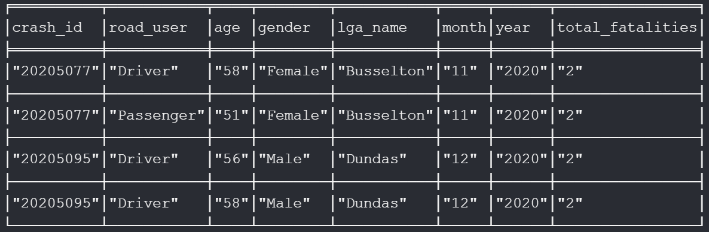{width="90%"}

2.  Find the maximum and minimum age for female and male **motorcycle riders** who were involved in fatal crashes during the **Christmas Period** or **Easter Period** in i**nner regional Australia**. Output the following information: **gender**, **maximum age** and **minimum age**. (Hint: Zero results is a meaningful result in itself.)

**Cypher code:**

```         
MATCH (f:fatality)-[:GENDER_IS]->(g:gender)
MATCH (f)-[:ROAD_USER_IS]->(ru:road_user)
MATCH (f)-[:IN_CRASH]->(c:crash)-[:IN_EVENT]->(h:holiday)
MATCH (c)-[:IN_NRA]->(nra:nra)
WHERE (toLower(h.christmas) = "yes" OR toLower(h.easter) = "yes")
  AND toLower(nra.nra) = "inner regional australia"
  AND toLower(ru.road_user) = "motorcycle rider"
  AND toLower(g.gender) IN ["male", "female"]
RETURN
  g.gender AS gender,
  max(toInteger(f.age)) AS max_age,
  min(toInteger(f.age)) AS min_age
ORDER BY gender;
```

**Result:**

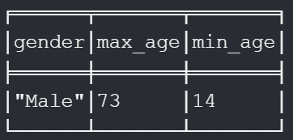{width="26%"}

3.  How many young **drivers** (**Age Group = '17_to_25'**) were involved in fatal crashes on weekends vs. weekdays in each state during **2024**? Output 4 columns: **State name**, **weekends**, **weekdays**, and the **average age for all young drivers (Age Group = '17_to_25') who were involved in fatal crashes in each State**.

**Cypher code:**

```         
MATCH (f:fatality)-[:AGE_IS]->(ag:age_group)
MATCH (f)-[:IN_CRASH]->(c:crash)-[:IN_DATE]->(d:date)
MATCH (c)-[:IN_LGA]->(lga:lga)-[:IN_SA4]->(:sa4)-[:IN_STATE]->(s:state)
WHERE toLower(ag.age_group) = '17_to_25' AND toInteger(d.year) = 2024
WITH s.state AS state, toLower(d.day_of_week) AS day_of_week, f.age AS age
WITH state,
     sum(CASE WHEN day_of_week = 'weekend' THEN 1 ELSE 0 END) AS weekends,
     sum(CASE WHEN day_of_week = 'weekday' THEN 1 ELSE 0 END) AS weekdays,
     collect(age) AS ages
RETURN state, weekends, weekdays,
       CASE WHEN size(ages) > 0 THEN round(reduce(acc=0.0, a IN ages | acc + toFloat(a))/size(ages),2) ELSE null END AS avg_age
ORDER BY state;
```

**Result:**

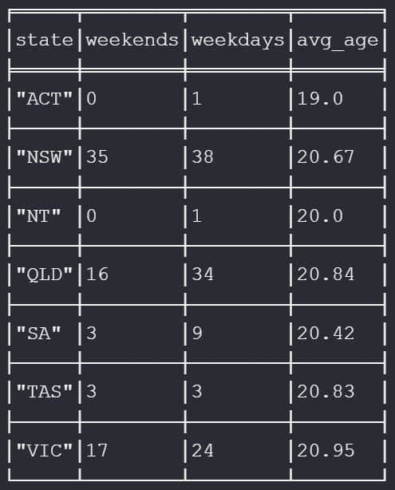{width="35%"}

4.  Identify all crashes in **WA** that occurred **Friday** (but categorised as a **weekend**) and resulted in **multiple deaths**, with victims being **both male and female**. For each crash, output the **SA4 name**, **national remoteness areas**, and **national road type**.

**Cypher code:**

```         
MATCH (c:crash)-[:IN_LGA]->(lga:lga)-[:IN_SA4]->(sa4:sa4)-[:IN_STATE]->(state:state)
MATCH (c)-[:IN_DATE]->(d:date)
MATCH (c)-[:IN_ROAD_TYPE]->(rt:road_type)
MATCH (c)-[:IN_NRA]->(nra:nra)
WHERE toLower(state.state) = "wa"
  AND toLower(d.day_of_week) = "weekend"
  AND toLower(d.dayweek) = "friday"
  AND toInteger(c.fatalities) > 1
WITH c, sa4, nra, rt
MATCH (f1:fatality)-[:IN_CRASH]->(c)
MATCH (f1)-[:GENDER_IS]->(g1:gender)
WITH c, sa4, nra, rt, collect(DISTINCT toLower(g1.gender)) AS genders
WHERE "male" IN genders AND "female" IN genders
RETURN DISTINCT sa4.sa4 AS sa4_name,
                nra.nra AS national_remoteness_areas,
                rt.road_type AS national_road_type,
                c.crash_id AS crash_id
ORDER BY sa4_name;
```

**Result:**

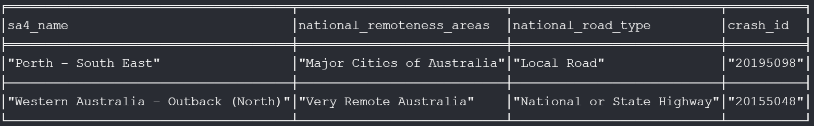{width="100%"}

5.  Find the top 5 SA4 regions where the highest number of fatal crashes occur during peak hours (**Time between 07:00-09:00 and 16:00-18:00**). For each SA4 region, output the **name** of the region and the separate number of crashes that occurred during morning peak hours and afternoon peak hours (Renamed Morning Peak and Afternoon Peak).

**Cypher code:**

```         
MATCH (c:crash)-[:IN_LGA]->(lga:lga)-[:IN_SA4]->(sa4:sa4)
MATCH (c)-[:IN_TIME]->(t:time)
WITH sa4.sa4 AS sa4_name,
     CASE WHEN toInteger(t.hour) >= 7 AND toInteger(t.hour) < 9 THEN 1 ELSE 0 END AS is_morning_peak,
     CASE WHEN toInteger(t.hour) >= 16 AND toInteger(t.hour) < 18 THEN 1 ELSE 0 END AS is_afternoon_peak
RETURN sa4_name,
       sum(is_morning_peak) AS Morning_Peak,
       sum(is_afternoon_peak) AS Afternoon_Peak
ORDER BY (Morning_Peak + Afternoon_Peak) DESC
LIMIT 5;
```

**Result:**

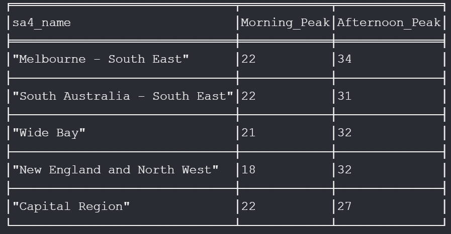{width="74%"}

6.  Find paths with a length of 3 between any two LGAs. **Return the top 3 paths, including the starting LGA and ending LGA for each path**. Order results alphabetically by starting LGA and then ending LGA.

**Cypher code:**

```         
MATCH p = (lga1:lga)-[*3]-(lga2:lga)
WHERE lga1 <> lga2
WITH lga1.lga AS start_lga, lga2.lga AS end_lga, p
ORDER BY start_lga, end_lga
RETURN start_lga, end_lga, p
LIMIT 3;
```

**Result:**

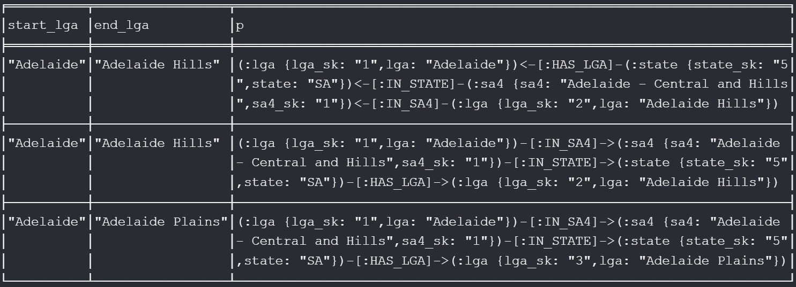{width="100%"}

7.  Find all weekday fatal crashes involving **pedestrians** where either **buses or heavy rigid trucks** were present in **speed zones less than 40 or greater than/equal to 100**. Group these crashes by unique combinations of **time of day**, **age group**, **vehicle type** (bus or heavy rigid truck), and **speed limitation**. For each group, count the number of crashes that occurred. Output a table showing **time of day**, **age group**, **vehicle type**, **crash count**, and **speed limitation**, sorted first by **time of day** (ascending) and then by **age group** (ascending).

**Cypher code:**

```         
MATCH (c:crash)-[:IN_TIME]->(t:time)
MATCH (c)-[:IN_SPEED_LIMIT]->(sl:speed_limit)
MATCH (c)-[:INVOLVEMENT_IS]->(inv:involvement)
MATCH (f:fatality)-[:IN_CRASH]->(c)
MATCH (f)-[:AGE_IS]->(ag:age_group)
MATCH (f)-[:ROAD_USER_IS]->(ru:road_user)
MATCH (c)-[:IN_DATE]->(d:date)
WHERE toLower(d.day_of_week) = 'weekday'
  AND toLower(ru.road_user) = 'pedestrian'
  AND (
    toLower(inv.bus) = 'yes'
    OR toLower(inv.heavy_rigid_truck) = 'yes'
  )
  AND (
    toInteger(sl.speed_limit) < 40
    OR toInteger(sl.speed_limit) >= 100
  )
WITH
  t.time_of_day AS time_of_day,
  ag.age_group AS age_group,
  CASE
    WHEN toLower(inv.bus) = 'yes' THEN 'bus'
    WHEN toLower(inv.heavy_rigid_truck) = 'yes' THEN 'heavy rigid truck'
    ELSE 'other'
  END AS vehicle_type,
  sl.speed_limit AS speed_limit,
  count(DISTINCT c.crash_id) AS crash_count
RETURN
  time_of_day, age_group, vehicle_type, crash_count, speed_limit
ORDER BY time_of_day ASC, age_group ASC;
```

**Result:**

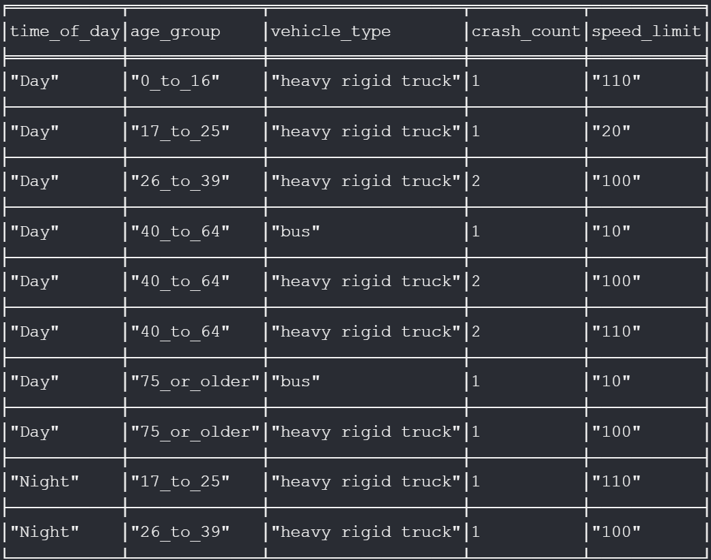{width="72%"}

**Two additional questions:**

8.  For each **state**, in **2023**, find the number of **fatal crashes** by **crash type** and the **average speed limit**.

**Cypher code:**

```         
MATCH (c:crash)-[:IN_DATE]->(d:date)
WHERE toInteger(d.year) = 2023
MATCH (c)-[:CRASH_TYPE_IS]->(ct:crash_type)
MATCH (c)-[:IN_LGA]->(lga:lga)
MATCH (lga)<-[:HAS_LGA]-(state:state)
MATCH (c)-[:IN_SPEED_LIMIT]->(sl:speed_limit)
RETURN
    state.state AS state,
    ct.crash_type AS crash_type,
    COUNT(DISTINCT c.crash_sk) AS number_of_crashes,
    round(AVG(toInteger(sl.speed_limit)), 0) AS average_speed_limit
ORDER BY state, crash_type;
```

**Result:**

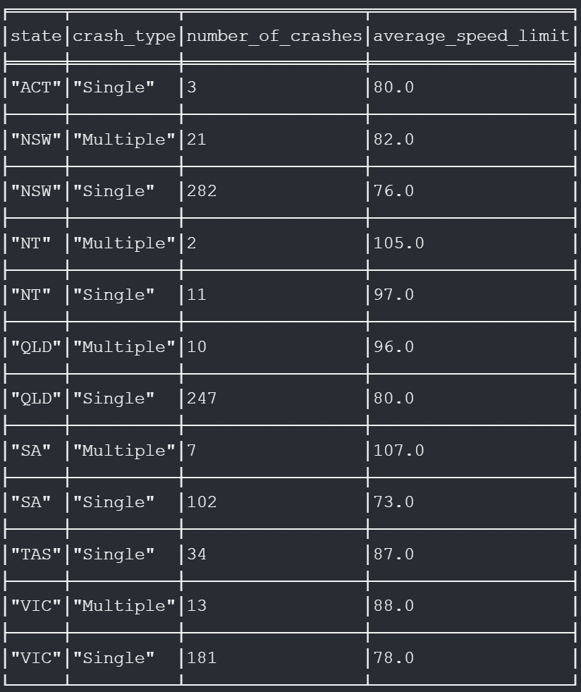{width="57%"}

9.  Find all **fatal** **crashes** on **weekends** (Saturday or Sunday) where the **victim** was a **pedestrian** **aged** **0 to 16**. For each matching fatality, report the **crash ID**, **remoteness area**, **road type**, **LGA** name, **age** of the **pedestrian**, and the **road user type.** Limit the output to the first 5 results, ordered by **remoteness area**, **road** **type**, **LGA** name, and **crash ID.**

**Cypher code:**

```         
MATCH (f:fatality)-[:ROAD_USER_IS]->(ru:road_user)
WHERE ru.road_user = 'Pedestrian' AND toInteger(f.age) <= 16
MATCH (f)-[:IN_CRASH]->(c:crash)-[:IN_LGA]->(lga:lga)
MATCH (c)-[:IN_NRA]->(nra:nra)
MATCH (c)-[:IN_DATE]->(d:date)
WHERE d.dayweek IN ['Saturday', 'Sunday']
MATCH (c)-[:IN_ROAD_TYPE]->(rt:road_type)
RETURN
    c.crash_id AS crash_id,
    nra.nra AS remoteness_area,
    rt.road_type AS road_type,
    lga.lga AS lga_name,
    f.age AS age,
    ru.road_user AS road_user_type
ORDER BY remoteness_area, road_type, lga_name, crash_id
LIMIT 5;
```

**Result:**

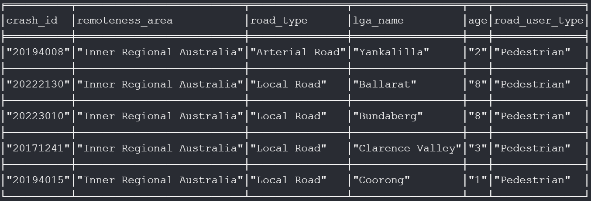{width="100%"}

## V. Graph Data Science

To explore the graph data science capabilities of the current database, we address the following task:

Identify clusters of road fatalities that share similar characteristics across age group, gender, road user type, speed limit, and crash type using graph-based community detection.

The following code uses the Neo4j Graph Data Science (GDS) [4] library to project the property graph, run community detection (Louvain algorithm [5]), and summarize the detected clusters:

**Graph projection:** We construct an in-memory property graph where each fatality is linked to its age group, gender, road user type, speed limit, and crash type.

```         
CALL gds.graph.project.cypher(
  'fatality-gds-cluster-all',
  // Node projection
  '
    MATCH (f:fatality)
    RETURN id(f) AS id
    UNION
    MATCH (f:fatality)-[:AGE_IS]->(ag:age_group)
    RETURN id(ag) AS id
    UNION
    MATCH (f:fatality)-[:GENDER_IS]->(g:gender)
    RETURN id(g) AS id
    UNION
    MATCH (f:fatality)-[:ROAD_USER_IS]->(ru:road_user)
    RETURN id(ru) AS id
    UNION
    MATCH (f:fatality)-[:IN_SPEED_LIMIT]->(sl:speed_limit)
    RETURN id(sl) AS id
    UNION
    MATCH (f:fatality)-[:IN_CRASH]->(c:crash)-[:CRASH_TYPE_IS]->(ct:crash_type)
    RETURN id(ct) AS id
  ',
  // Relationship projection
  '
    MATCH (f:fatality)-[:AGE_IS]->(ag:age_group)
    RETURN id(f) AS source, id(ag) AS target, "AGE_IS" AS type
    UNION
    MATCH (f:fatality)-[:GENDER_IS]->(g:gender)
    RETURN id(f) AS source, id(g) AS target, "GENDER_IS" AS type
    UNION
    MATCH (f:fatality)-[:ROAD_USER_IS]->(ru:road_user)
    RETURN id(f) AS source, id(ru) AS target, "ROAD_USER_IS" AS type
    UNION
    MATCH (f:fatality)-[:IN_SPEED_LIMIT]->(sl:speed_limit)
    RETURN id(f) AS source, id(sl) AS target, "IN_SPEED_LIMIT" AS type
    UNION
    MATCH (f:fatality)-[:IN_CRASH]->(c:crash)-[:CRASH_TYPE_IS]->(ct:crash_type)
    RETURN id(f) AS source, id(ct) AS target, "CRASH_TYPE_IS" AS type
  '
)
YIELD graphName, nodeCount, relationshipCount;
```

**Result:**

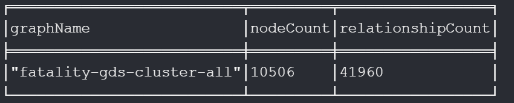{width="60%"}

**Community detection:** We apply the Louvain algorithm to identify clusters of fatalities with similar profiles across these dimensions.

```         
CALL gds.louvain.write('fatality-gds-cluster-all', {
  writeProperty: 'communityId'
})
YIELD communityCount, modularity, writeMillis;
```

**Result:**

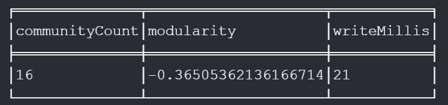{width="60%"}

**Cluster summary:** We summarize the size of each detected cluster and inspect 5 sample cases from each of the two result clusters.

```         
// Summarize the size of each detected cluster
MATCH (f:fatality)
WHERE f.communityId IS NOT NULL
RETURN f.communityId AS cluster, count(*) AS size
ORDER BY size DESC;
```

**Result:**

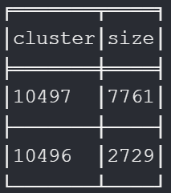{width="101"}

```         
// Inspect 5 sample cases from each of the two result clusters.
MATCH (f:fatality)
WHERE f.communityId = 10496
RETURN f.communityId AS cluster, f.fatality_sk
ORDER BY f.fatality_sk
LIMIT 5

UNION ALL

MATCH (f:fatality)
WHERE f.communityId = 10497
RETURN f.communityId AS cluster, f.fatality_sk
ORDER BY f.fatality_sk
LIMIT 5
```

**Result:**

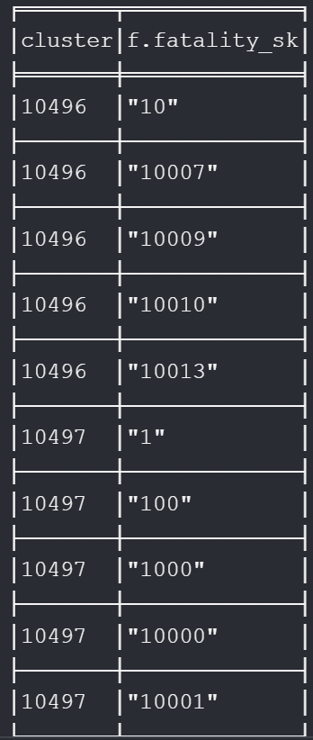{width="28%"}

The Louvain community detection algorithm identified two main clusters of fatalities, each representing groups of cases with similar combinations of age group, gender, road user type, speed limit, and crash type.

The largest cluster includes the majority of cases, while the second cluster captures a distinct minority with different attribute patterns.

This suggests that most fatalities in the dataset share common profiles, but there are smaller, differentiated subgroups that may require separate analysis or targeted interventions.

**Academic AI Usage Statement**

AI tools such as Grammarly and ChatGPT model 4.1 were used exclusively for editing, searching for reference documents, and automating repetitive Cypher coding tasks. All core code, features, design, and contextual writing were authored and fully controlled by me, the author. In all cases where AI assistance was employed, its outputs were strictly supervised and guided by explicit instructions, by professional standards expected of developers, data scientists, and engineers.

The use of AI tools in this project is consistent with the academic integrity guidelines and permissions set by the University of Western Australia and the unit coordinator.

# References

1.  Australian Government Department of Infrastructure, Transport, Regional Development and Communications. Australian Road Deaths Database. Available at: <https://www.bitre.gov.au/statistics/safety/fatal_road_crash_database>

2.  Kimball, R., & Ross, M. (2013). *The Data Warehouse Toolkit: The Definitive Guide to Dimensional Modeling* (3rd ed.). Wiley.

3.  Neo4j Cypher Manual. Neo4j. Available at: <https://neo4j.com/docs/cypher-manual/current/>

4.  Neo4j Graph Data Science Documentation. Neo4j. Available at: <https://neo4j.com/docs/graph-data-science/current/>

5.  Blondel, V. D., Guillaume, J. L., Lambiotte, R., & Lefebvre, E. (2008). Fast unfolding of communities in large networks. *Journal of Statistical Mechanics: Theory and Experiment*, 2008(10), P10008. <https://doi.org/10.1088/1742-5468/2008/10/P10008>
